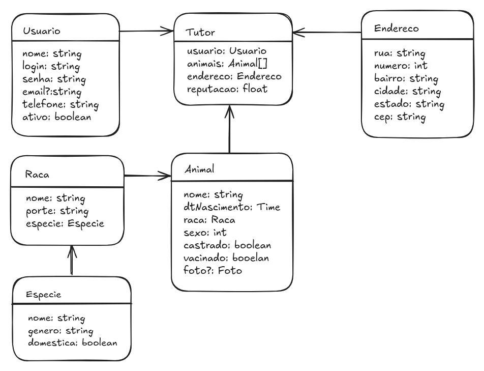

# Backend

Implementação do **backend** da aplicação, que inclui uma **API RESTful** e um **CLI** (Interface de Linha de Comando) para interagir com o banco de dados.


1. **API RESTful**:  
   Uma interface programática que permite integrações com aplicativos móveis, sites ou outros sistemas. A API fornece endpoints para gerenciar pets, usuários, adoções e muito mais.

2. **CLI (Interface de Linha de Comando)**:  
   Uma ferramenta poderosa para desenvolvedores e administradores interagirem diretamente com o banco de dados, executando tarefas como cadastro de pets, listagem de adoções e gerenciamento de usuários.

---

## **Funcionalidades do Backend**

### **API RESTful**
- **Cadastro de Pets**: Registre novos pets disponíveis para adoção, incluindo informações como nome, espécie, raça, idade e foto.
- **Listagem de Pets**: Recupere a lista de pets cadastrados, com filtros por espécie, idade ou status de adoção.
- **Gerenciamento de Usuários**: Cadastre e gerencie usuários, incluindo adotantes e administradores.
- **Processo de Adoção**: Registre adoções, vinculando pets a usuários e atualizando o status do pet.
- **Autenticação e Autorização**: Proteja os endpoints com autenticação JWT e controle de acesso baseado em roles.

### **CLI**
- **Cadastro Rápido**: Adicione pets e usuários diretamente pelo terminal.
- **Consultas**: Liste pets, usuários ou adoções com filtros personalizados.
- **Gerenciamento**: Atualize ou remova registros do banco de dados.
- **Automação**: Execute tarefas repetitivas ou em lote, como migrações de banco de dados ou geração de relatórios.

---

## **Tecnologias Utilizadas**

- **Linguagem**: Go (Golang)
- **Banco de Dados**: PostgreSQL (com GORM para ORM)
- **API**: RESTful, com autenticação JWT
- **CLI**: Cobra (biblioteca para criação de CLIs em Go)

---

## Pre-Requisitos

Para executar o projeto, por padrão, utilizasse:

- Docker
- Go

## Inicializando o Bando de dados

1 - Rodar Docker compose

```bash
sudo docker compose up
```

2 - Sugestões de ferramentas para fazer o gerenciamento do banco de dados
    - PGAdmin
    - Dbeaver

3 - Configure o `.env` com as seguintes variavéis

```
DATABASE_HOST=""
DATABASE_PORT=""
DATABASE_USER=""
DATABASE_PASSWORD=""
DATABASE_NAME=""
DATABASE_SSL_MODE=""
DATABASE_TIMEZONE=""
```

## Executando o projeto

- Para executar a **API** projeto basta utilizar o comando

```bash
go run cmd/api/main.go
```

O uso do cli pode ser utilizado, com o build do executavel ou utilizando o caminho do arquivo principal com a inclusão dos comandos

```bash
go run cmd/cli/main.go ping
```

- **Lista de Comandos**

- **ping**: retorna "PONG"
- **version**: retorna a versão atual do projeto
- **meta**: retorna o metadata do projeto
- **create-admin**: criar um usuário administrador
- **update-admin**: atualizar dados do administrador
- **create-user**: criar usuário comum
- **reset-password**: redefinir a senha de um usuário
- [...]


# Entidades

1. **Usuarios**: a entidade irá auxiliar na construção da autenticação do projeto
2. **Admins**: responsáveis por fazer o controle de adoções (ONGs, Canis, Secretarias, Encarregados, ...)
3. **Tutores**: usuários que irão demonstrar o interesse em adotar um animal.
4. **Endereço**: endereços que serão incorporados aos tutores
5. **Especie**: a especie do animal que poderá ser adotado
6. **Raça**: raça do animal que poderá ser adotado
7. **Animal**: animal que está disponivel para adoção



# Rotas

1. **METADATA**

    - `ping`: retorna pong
    - `version`: retorna versão do recurso

2. **Usuário**

    - `usuario`: criar um usuario

3. **Especies**

    - [GET] `especies`: retorna uma listagem de todas as especies cadastradas
    - [POST] `especie`: cria uma nova instancia de especie
    - [PATCH] `especie/:id`: atualiza os dados de uma especie

4. **Raças**

    - [GET] `racas`: retorna uma listagem com todas as raças cadastradas
    - [POST] `raca`: cria uma nova instancia de raça
    - [PATCH] `raca/:id`: atualiza os dados de uma raça

5. **Animais**

    - [GET] `animais`: retorna uma listagem de todos os animais cadastrados
    - [GET] `animais/:id`: realiza uma busca de um animal pelo id
    - [POST] `animal`: cria uma nova instancia de animal
    - [PATCH] `animal/:id`: atualiza os dados de um animal

6. **Endereços**

    - [GET] `enderecos`: retorna uma listagem de todos os endereços cadastrados
    - [POST] `endereco`: cria uma nova instancia de endereço
    - [PATCH] `endereco/:id`: atualiza os dados de um endereço

7. **Tutor**

    - [GET] `tutores`: retorna uma listagem de todos os tutores
    - [POST] `tutor`: cria uma nova instancia de tutor